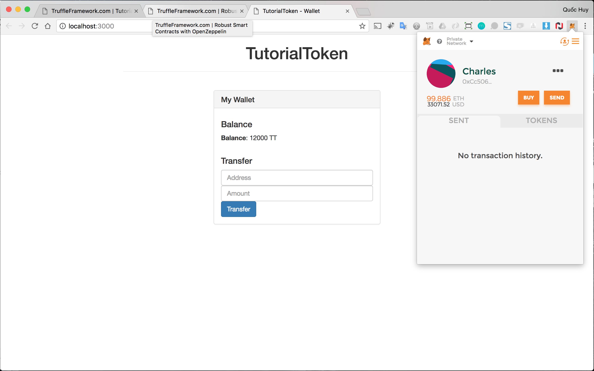
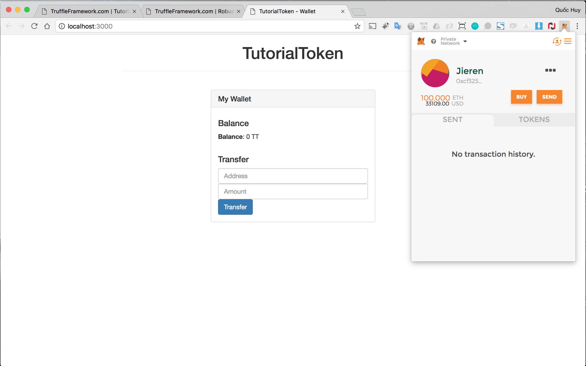
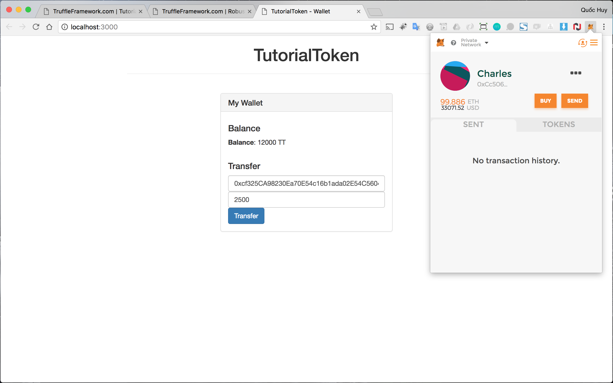
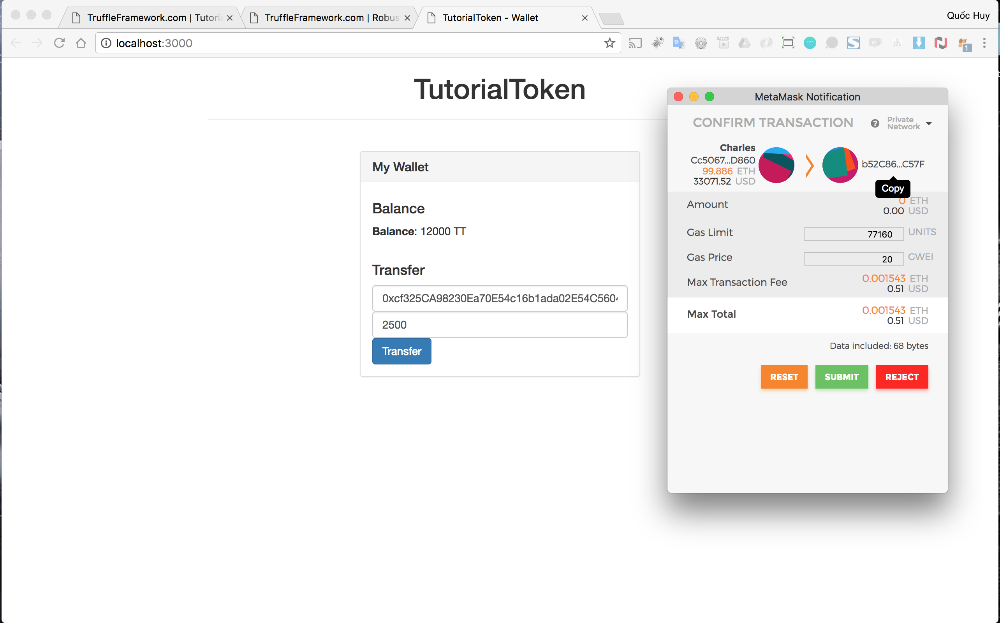
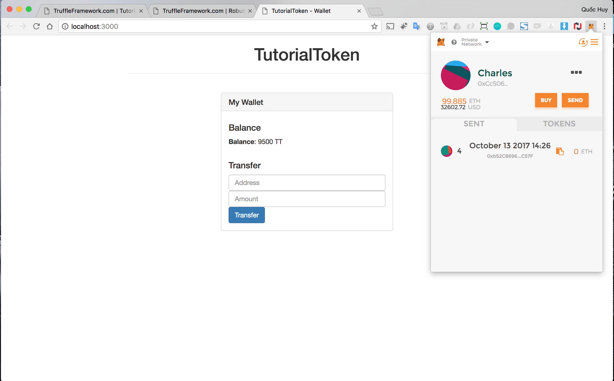
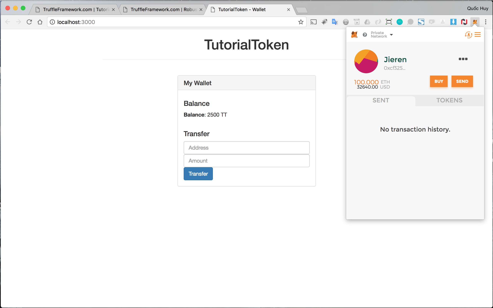

# OpenZeppelin
BUILDING ROBUST SMART CONTRACTS WITH OPENZEPPELIN

Goals:

- Unboxing the front-end application
- Creating the "TutorialToken" smart contract
- Compiling and deploying the smart contract to the TestRPC
- Interacting with the new token

## Screenshots

### App UI

### Transfer token arround

##### init

Sender balance

Receiver balance

##### process transaction

##### after

Sender balance

Receiver balance

-----

Source: [OpenZeppelin](http://truffleframework.com/tutorials/robust-smart-contracts-with-openzeppelin)
